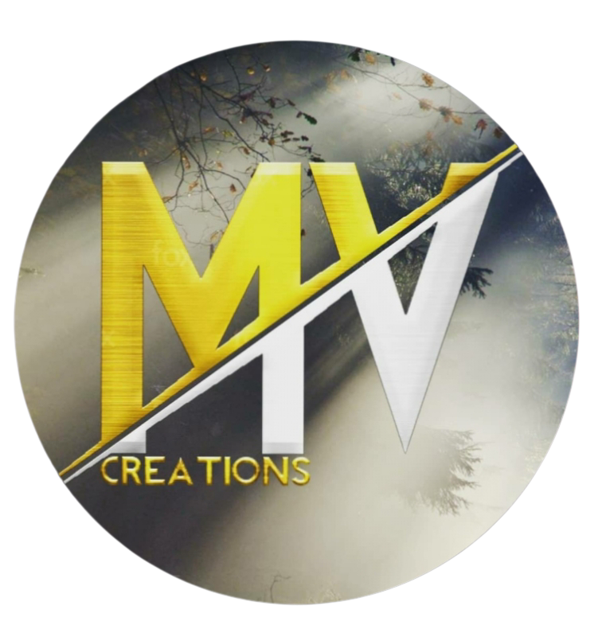

# LVS Live TV

A premium, cross-platform Live TV streaming solution featuring a responsive web application and native applications for Android and Linux.



## 🌟 Features

### Cross-Platform Native App (Android & Linux)
- **True Native Experience**: Built with Flutter for maximum performance on both Mobile and Desktop.
- **Universal Player**: Powered by `media_kit` (FFmpeg-based) for full codec support including **AC3/Dolby Digital** audio.
- **Wakelock**: Prevents screen timeout while watching.
- **Smart UI**:
  - Responsive Grid Layout (adapts to Phone vs PC).
  - Animated channel cards with focus/hover effects.
  - Custom fullscreen OSD with LIVE badge, channel info & controls.
  - Keyboard/remote shortcut support (Arrow keys for channel switching, Enter to play/pause).

### Web Application
- **Browser Support**: The web version (`index.html`) works for quick browser access.
- **Access Control**: Simple login gate (code: `lvs`) with `localStorage` persistence.
- **HLS Streaming**: Uses `hls.js` for `.m3u8` stream playback.
- **Modern UI**: Dark theme with glassmorphism effects, real-time channel search.
- **Shared Config**: Reads from the same `channels.json` as the native app.

---

## 📲 How to Use on Android

### Installation
1. Build or download the APK (see [Getting Started](#-getting-started) below)
2. Transfer `app-arm64-v8a-release.apk` to your phone
3. Open the file manager on your phone and tap the APK
4. If prompted *"Install from unknown sources"*, tap **Settings → Allow** for your file manager
5. Tap **Install** and then **Open**

---

### Home Screen
- All channels are displayed as a **scrollable grid**
- Each card shows the **channel logo**, **name**, and **category**
- **Tap any card** to start watching that channel immediately

---

### Video Player Controls

#### 👆 Touch Gestures
| Gesture | Action |
|---------|--------|
| **Tap centre** | Play / Pause |
| **Tap edge** | Show / hide controls |
| **Swipe Left** | Next channel ⏭ |
| **Swipe Right** | Previous channel ⏮ |
| **Swipe Up** | Jump to Live edge 📡 |
| **Swipe Down** | Back to channel list 🏠 |
| **Retry button** | Retry failed stream |

#### ⌨️ Keyboard / Remote Controls
| Key | Action |
|-----|--------|
| `Enter` / `OK` | Play / Pause |
| `←` Arrow Left | Previous channel |
| `→` Arrow Right | Next channel |
| `↑` Arrow Up | Jump to Live edge |
| `Back` | Return to channel list |

#### 📺 On-Screen Info
- **Red LIVE badge** — stream is at the live edge
- **Channel name & category** — shown in the bottom overlay
- **Loading spinner** — stream is buffering or reconnecting
- **Auto-reconnect** — the player retries automatically up to 5 times if the stream drops

---


### 1. Android App

**To Build the APK:**
```bash
cd live_tv
flutter pub get
flutter build apk --release --split-per-abi
```

| APK | For | Size |
|-----|-----|------|
| `app-arm64-v8a-release.apk` | Modern phones (64-bit) | ~32 MB |
| `app-armeabi-v7a-release.apk` | Older phones (32-bit) | ~29 MB |

📂 Output: `live_tv/build/app/outputs/flutter-apk/`

> **Note**: Enable **Developer Options → Install via USB** on your phone before installing via ADB.

### 2. Linux Desktop App

```bash
cd live_tv
flutter build linux --release
```

**One-Click Install** (creates desktop shortcut):
```bash
./install_linux.sh
```
Search for **"LVS Live TV"** in your applications menu!

### 3. Web Version
Serve the root directory with any static file server.
> ⚠️ Due to browser CORS restrictions, some stream URLs may not play without a CORS-bypass extension.

---

## 🛠 Configuration

### Adding / Editing Channels
Edit **`channels.json`** in the project root. After editing, copy it to the Flutter assets folder:
```bash
cp channels.json live_tv/assets/channels.json
```

Then rebuild the APK for changes to reflect in the native app.

**Channel format:**
```json
[
  {
    "name": "Channel Name",
    "icon": "https://link-to-icon.png",
    "url": "https://stream-url.com/playlist.m3u8",
    "category": "General"
  }
]
```

**Available categories:** `General`, `Movies`, `Music`, `Entertainment`, `News`, `Sports`, `Kids`, `Spiritual`, `Food`, `Lifestyle`, `Comedy`

---

## 📱 Tech Stack

| Layer | Technology |
|---|---|
| **Web App** | HTML5, CSS3, Vanilla JS, hls.js |
| **Native App** | Flutter (Dart) |
| **Video Player** | `media_kit` + `media_kit_video` (FFmpeg-based, supports AC3/EAC3) |
| **Image Loading** | `cached_network_image` |
| **Screen Management** | `wakelock_plus` |

---

## 📂 Project Structure

```
Live Tv-TV/
├── index.html            # Web app
├── style.css             # Web app styles
├── script.js             # Web app logic
├── channels.json         # Channel list (source of truth)
├── channels.js           # Legacy JS channel list (web fallback)
├── install_linux.sh      # Linux desktop installer script
└── live_tv/              # Flutter native app
    ├── lib/
    │   ├── main.dart             # App entry point
    │   ├── channel.dart          # Channel data model
    │   ├── home_page.dart        # Channel grid UI
    │   └── video_player_page.dart # Fullscreen media_kit player
    └── assets/
        └── channels.json        # Bundled channel list (copy of root)
```
